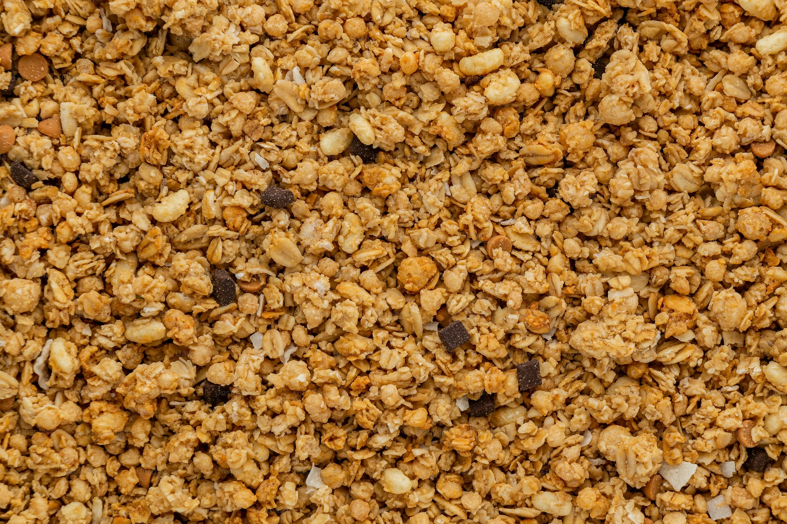

---
sourceUrl:
spoonacularSourceUrl:
imageSource: https://unsplash.com/photos/BfqNd1pvDqE
date: 2024-02-17
cooking_time: 35
servings: 16
tags: [granola, apple, cinnamon, breakfast]
---
# Apple Cinnamon Granola

- 2 cups regular rolled oats
- 1/2 cup coconut
- 1/2 cup coarsely chopped slivered or sliced almonds, or chopped peanuts
- 1/2 cup sunflower nuts
- 1/4 cup sesame seeds
- 1/2 cup honey or maple-flavored syrup
- 1/3 cup cooking oil
- 1 cup dried apples or other fruit
- 1 tsp ground cinnamon

1. Preheat oven to 300 degrees F (150 degrees C).
2. In a bowl, stir together rolled oats, coconut, cinnamon, almonds or peanuts, sunflower nuts, and sesame seeds.
3. In another bowl, combine honey or syrup and oil, stir into oat mixture.
4. Spread mixture evenly into a greased 15x10x1-inch baking pan.
5. Bake for 30 to 35 minutes or till lightly browned, stirring after 20 minutes.
6. Remove from the oven and immediately turn out onto a large piece of foil. Add dried fruit. Cool, then break into clumps. Store in tightly covered jars or plastic bags at room temperature for up to 2 weeks. For longer storage, seal in freezer bags and freeze.

